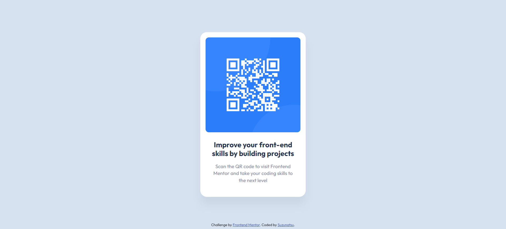

# Frontend Mentor - QR code component solution

This is a solution to the [QR code component challenge on Frontend Mentor](https://www.frontendmentor.io/challenges/qr-code-component-iux_sIO_H). Frontend Mentor challenges help you improve your coding skills by building realistic projects. 

## Table of contents

- [Frontend Mentor - QR code component solution](#frontend-mentor---qr-code-component-solution)
  - [Table of contents](#table-of-contents)
  - [Overview](#overview)
    - [Screenshot](#screenshot)
    - [Links](#links)
  - [My process](#my-process)
    - [Built with](#built-with)
    - [What I learned](#what-i-learned)
  - [Author](#author)


## Overview

### Screenshot

desctop  


mobile  


### Links

- Solution URL: [st0272\/fm-qr-code-component](https://github.com/st0272/fm-qr-code-component)
- Live Site URL: [fm-qr-code-component](https://demo.suzunatsu.com/fm-qr-code-component/)

## My process

### Built with

- Semantic HTML5 markup

### What I learned

Google Fonts setting

```html
/* head */
<link rel="preconnect" href="https://fonts.googleapis.com" />
<link rel="preconnect" href="https://fonts.gstatic.com" crossorigin />
<link
  href="https://fonts.googleapis.com/css2?family=Outfit:wght@100..900&display=swap"
  rel="stylesheet"
/>
```

```css
body {
  font-family: "Outfit", sans-serif;
}
```

Min-height setting width CSS logical properties (body and container)

```css
body {
  min-height: 100dvb;
}
.container {
  min-height: 100dvb;
}
```

Card centering with grid layout

```css
.container {
  display: block grid;
  place-content: center;
}
```

Sticky positioning (attribution content)

```css
.attribution {
  position: sticky;
  top: 100dvb;
}
```

## Author

- Website - [Suzunatsu Website](https://www.suzunatsu.com)
- Frontend Mentor - [@st0272](https://www.frontendmentor.io/profile/st0272)
- Twitter - [@suzuantsu_](https://www.twitter.com/suzuantsu_)